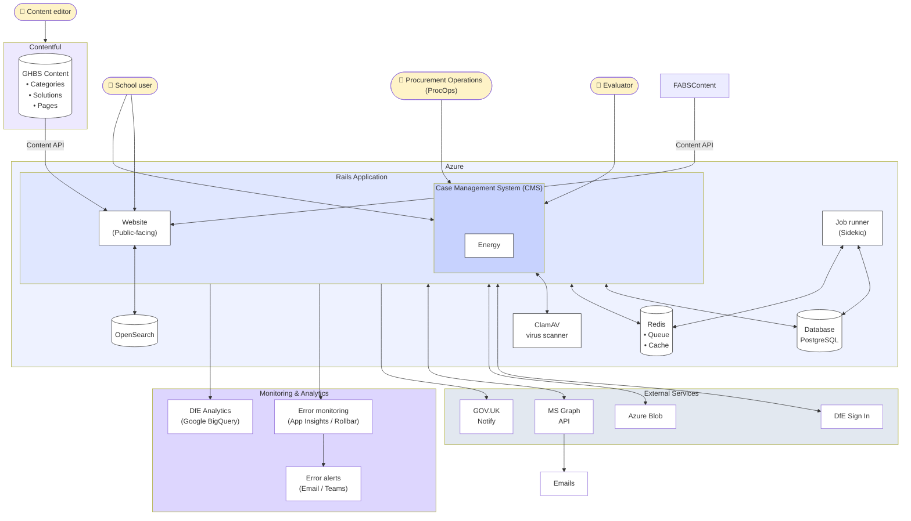

# Combined GHBS Architecture

This diagram shows the combined architecture after merging FABS and BFYS into a single Rails monolith.

**URL:** www.get-help-buying-for-schools.service.gov.uk

**Features:**
- Buying solutions (formerly FABS)
- Request for help
- Case Management (CMS)
- Energy for Schools
- Create a spec
- Evaluate a bid
- Frameworks portal
- Surveys

## Key Changes from Previous Architecture

| Before (Separate Apps) | After (Combined) |
|------------------------|------------------|
| FABS on Heroku | Single app on Azure |
| BFYS on Azure | Single app on Azure |
| Two separate databases | One PostgreSQL database |
| Two Redis instances | One Redis instance |
| JSON API sync between apps | Direct database access |
| Separate deployments | Single deployment |

## Components

### Hosting
- **Azure** - Cloud hosting platform for the combined application

### Application
- **Web** - Rails web server handling HTTP requests
- **Job runner (Sidekiq)** - Background job processing

### Data Stores
- **PostgreSQL** - Primary relational database
- **Redis** - Job queue and caching
- **OpenSearch** - Full-text search for frameworks/buying solutions

### Content Management
- **Contentful** - Headless CMS with two content spaces:
  - FABS Content (buying solutions, images)
  - GHBS Self-serve (questions, tasks for guided journeys)

### External Services
- **DfE Sign In** - Authentication for school users
- **MS Graph API** - Outlook email integration for case management
- **GOV.UK Notify** - Transactional emails and notifications
- **AWS AzureBlob / Azure Blob** - File storage
- **ClamAV** - Antivirus scanning for uploads

### Monitoring & Analytics
- **Rollbar** - Error tracking and alerting
- **DfE Analytics** - Event tracking to Google BigQuery
