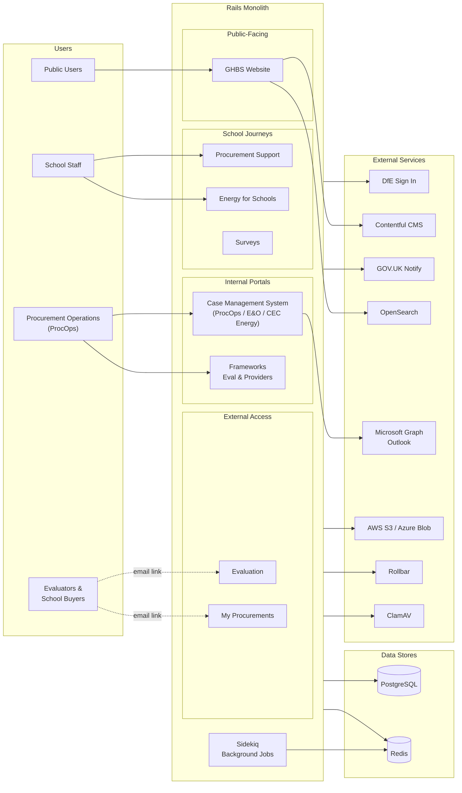

# High-Level Architecture

```mermaid
graph LR
    %% ── Users ──
    subgraph Users
        direction TB
        Public["Public Users"]
        School["School Staff"]
        Internal["Procurement Operations<br/>(ProcOps)"]
        ExtAccess["Evaluators &<br/>School Buyers"]
    end

    %% ── Rails Monolith ──
    subgraph Monolith["Rails Monolith"]
        direction TB

        subgraph PublicPortals["Public-Facing"]
            GHBS["GHBS Website"]
        end

        subgraph SchoolPortals["School Journeys"]
            ProcSupport["Procurement Support"]
            EnergyPortal["Energy for Schools"]
            Surveys["Surveys"]
        end

        subgraph InternalPortals["Internal Portals"]
            CMS["Case Management System<br/>(ProcOps / E&O / CEC Energy)"]
            FWPortal["Frameworks<br/>Eval & Providers"]
        end

        subgraph ExtPortals["External Access"]
            EvalPortal["Evaluation"]
            MyProc["My Procurements"]
        end

        Sidekiq["Sidekiq<br/>Background Jobs"]
    end

    %% ── External Services ──
    subgraph Services["External Services"]
        direction TB
        DfESI["DfE Sign In"]
        Contentful["Contentful CMS"]
        Notify["GOV.UK Notify"]
        OpenSearch["OpenSearch"]
        Outlook["Microsoft Graph<br/>Outlook"]
        S3["AWS S3 / Azure Blob"]
        Rollbar["Rollbar"]
        ClamAV["ClamAV"]
    end

    %% ── Data Stores ──
    subgraph Data["Data Stores"]
        direction TB
        Postgres[("PostgreSQL")]
        Redis[("Redis")]
    end

    %% ── User → Portal ──
    Public --> GHBS
    School --> ProcSupport
    School --> EnergyPortal
    Internal --> CMS
    Internal --> FWPortal
    ExtAccess -.->|email link| EvalPortal
    ExtAccess -.->|email link| MyProc

    %% ── Monolith → Services ──
    GHBS --> Contentful
    GHBS --> OpenSearch
    CMS --> Outlook
    Monolith --> DfESI
    Monolith --> Notify
    Monolith --> S3
    Monolith --> ClamAV
    Monolith --> Rollbar

    %% ── Monolith → Data ──
    Monolith --> Postgres
    Monolith --> Redis
    Sidekiq --> Redis
```
