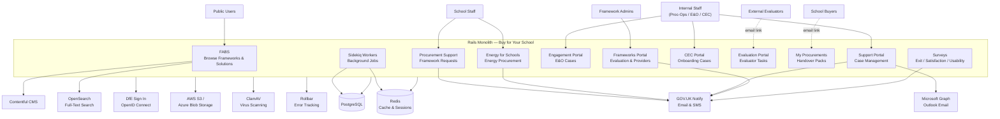

# High-Level Architecture

```mermaid
graph TD
    %% ── User types ──
    Public["Public Users"]
    School["School Staff"]
    Internal["Internal Staff<br/>(Proc-Ops / E&O / CEC)"]
    FWAdmin["Framework Admins"]
    ExtEval["External Evaluators"]
    ExtBuyer["School Buyers"]

    %% ── Rails Monolith ──
    subgraph Monolith["Rails Monolith — Buy for Your School"]
        FABS["FABS<br/>Browse Frameworks & Solutions"]
        ProcSupport["Procurement Support<br/>Framework Requests"]
        EnergyPortal["Energy for Schools<br/>Energy Procurement"]
        SupportPortal["Support Portal<br/>Case Management"]
        EngagementPortal["Engagement Portal<br/>E&O Cases"]
        FWPortal["Frameworks Portal<br/>Evaluation & Providers"]
        CECPortal["CEC Portal<br/>Onboarding Cases"]
        EvalPortal["Evaluation Portal<br/>Evaluator Tasks"]
        MyProc["My Procurements<br/>Handover Packs"]
        Surveys["Surveys<br/>Exit / Satisfaction / Usability"]
        Sidekiq["Sidekiq Workers<br/>Background Jobs"]
    end

    %% ── External Services ──
    DfESI["DfE Sign In<br/>OpenID Connect"]
    Contentful["Contentful CMS"]
    Notify["GOV.UK Notify<br/>Email & SMS"]
    OpenSearch["OpenSearch<br/>Full-Text Search"]
    Outlook["Microsoft Graph<br/>Outlook Email"]
    S3["AWS S3 /<br/>Azure Blob Storage"]
    Rollbar["Rollbar<br/>Error Tracking"]
    ClamAV["ClamAV<br/>Virus Scanning"]

    %% ── Infrastructure ──
    Postgres[("PostgreSQL")]
    Redis[("Redis<br/>Cache & Sessions")]

    %% ── User → Portal connections ──
    Public --> FABS
    School --> ProcSupport
    School --> EnergyPortal
    Internal --> SupportPortal
    Internal --> EngagementPortal
    Internal --> CECPortal
    FWAdmin --> FWPortal
    ExtEval -.->|email link| EvalPortal
    ExtBuyer -.->|email link| MyProc

    %% ── Portal → External Service connections ──
    FABS --> Contentful
    FABS --> OpenSearch
    ProcSupport --> Notify
    EnergyPortal --> Notify
    SupportPortal --> Outlook
    SupportPortal --> Notify
    FWPortal --> Notify
    Surveys --> Notify

    %% ── Auth ──
    Monolith --> DfESI

    %% ── Shared services ──
    Monolith --> S3
    Monolith --> ClamAV
    Monolith --> Rollbar

    %% ── Infrastructure connections ──
    Monolith --> Postgres
    Monolith --> Redis
    Sidekiq --> Redis
    Sidekiq --> Postgres
```
